<!--
Purpose: Setup and usage documentation for Veo3 Short-Form Story Generator
Provides installation, configuration, and usage instructions
-->

# 🎬 Veo3 Short-Form Story Generator

A tool to generate 24-second video stories using Google's Veo3 API by chaining three 8-second clips with consistent characters. Now featuring **state-of-the-art Veo3 prompt optimization** for maximum quality and character consistency.

## 🔄 How It Works (Simple Overview)

```mermaid
flowchart TD
    A[📝 Story Input<br/>Choose character + write story prompt] 
    B[🤖 AI Script Generation<br/>3 optimized 8-second scene scripts]
    C[👀 User Review & Edit<br/>Built-in optimization tips]
    D[🎬 3x Veo3 Videos<br/>Generate simultaneously]
    E[🔗 Video Stitching<br/>Automatic FFmpeg processing]
    F[📱 Final 24s Video<br/>Download complete story]
    
    A --> B
    B --> C
    C --> D
    D --> E
    E --> F
    
    style A fill:#e3f2fd
    style B fill:#fff3e0
    style C fill:#f3e5f5
    style D fill:#fce4ec
    style E fill:#e8f5e8
    style F fill:#4caf50,color:#fff
```



**Simple Process:**
1. **Input**: Choose character + write story prompt
2. **Generate**: AI creates 3 optimized 8-second scene scripts  
3. **Review**: Edit scripts with built-in optimization tips
4. **Create**: Generate 3 videos simultaneously ($12 total)
5. **Combine**: Automatic video stitching into final story
6. **Download**: Get your 24-second video story

## 🔄 Technical Workflow

The following diagram shows the complete technical process from user input to final video:


## 🎯 Key Features

### 🔥 NEW: Advanced Veo3 Optimization
- **Character Bible System**: Detailed character descriptions for perfect consistency
- **8-Second Scene Timing**: Precise duration control for optimal pacing
- **Consistent Environment Flow**: Scenes transition smoothly in the same setting
- **Cinematic Prompt Structure**: Optimized for Veo3's capabilities
- **Camera Movement Control**: Professional cinematography terms
- **Audio Integration**: Native sound effects, dialogue, and music
- **Scene Editing**: Edit individual scene scripts with optimization tips

### Core Functionality
- **Character Selection**: Pre-configured characters with detailed descriptions
- **Script Generation**: AI-powered scene creation with OpenAI GPT-4
- **Video Generation**: Veo3 API integration via fal.ai
- **Video Concatenation**: Seamless FFmpeg-based video stitching
- **Cost Management**: Clear pricing ($12 per story) with user confirmation

## 🚀 Quick Start

### Prerequisites

- Node.js 16+ installed
- FFmpeg installed on your system
- OpenAI API key
- fal.ai API key (for Veo3 access)

### Installation

1. **Clone and setup**
```bash
git clone https://github.com/HenryAllen04/Veo3-Chain.git
cd Veo3-Chain
git checkout feature/veo3-story-generator
npm install
```

2. **Configure environment variables**
```bash
cp env.example .env
```

Edit `.env` and add your API keys:
```env
FAL_KEY=your_fal_api_key
OPENAI_API_KEY=your_openai_api_key
PORT=3000
```

3. **Create required directories**
```bash
mkdir -p temp output public
```

4. **Start the server**
```bash
npm run dev  # Development mode with auto-restart
# or
npm start    # Production mode
```

5. **Open your browser**
Navigate to `http://localhost:3000`

## 🎨 Veo3 Optimization Features

### Character Consistency
Our Character Bible ensures perfect consistency across scenes:
```javascript
stormtrooper: {
    description: "A classic Imperial Stormtrooper with gleaming white armor plating, distinctive black eye lenses in the helmet, utility belt with equipment pouches, and the iconic angular helmet design. The armor shows subtle battle-worn details and reflective surfaces.",
    voice: "speaks with a clear, authoritative voice slightly muffled by the helmet",
    mannerisms: "stands with military posture, gestures with precision"
}
```

### 8-Second Scene Structure
Each scene follows precise timing:
- **Duration**: Exactly 8 seconds for optimal pacing
- **Environment**: Consistent setting across all scenes
- **Character**: Verbatim character description repetition
- **Flow**: Logical progression from scene to scene

### Cinematic Control
- **Camera Movements**: dolly, pan, tracking, crane shots
- **Shot Composition**: close-up, medium shot, wide shot, POV
- **Lighting**: chiaroscuro, golden hour, neon glow
- **Audio**: Dialogue, SFX, ambient sound, music

### Scene Editing
- Edit button on each scene card
- Optimization tips in edit modal
- Real-time script updates
- Visual feedback on changes

## 📁 Project Structure

```
Veo3-Chain/
├── server.js              # Express server
├── src/
│   ├── scriptGenerator.js # Veo3-optimized script generation
│   ├── videoGenerator.js  # Veo3 API integration
│   └── videoProcessor.js  # FFmpeg concatenation
├── public/
│   ├── index.html         # Enhanced UI with edit features
│   └── app.js             # Advanced frontend with editing
├── temp/                  # Temporary video files
├── output/                # Final concatenated videos
└── VEO3_OPTIMIZATION_GUIDE.md # Comprehensive optimization guide
```

## 🎬 Workflow

1. **Character Selection**: Choose from optimized character presets
2. **Story Creation**: Enter your story prompt
3. **Script Generation**: AI creates 3 Veo3-optimized 8-second scene scripts
4. **Script Review & Edit**: Review and edit scripts with optimization tips
5. **Cost Confirmation**: Confirm ~$12 generation cost
6. **Video Generation**: Generate 3 videos with progress tracking
7. **Concatenation**: Automatic video stitching into 24-second story
8. **Download**: Get your final video

## 💰 Pricing

- **Script Generation**: ~$0.01 (OpenAI GPT-4)
- **Video Generation**: ~$12 (3 × 8-second videos at $0.50/second)
- **Total per story**: ~$12.01

## 🛠 Technical Implementation

### Script Generation (Enhanced)
- Character Bible integration
- 8-second duration constraints
- Veo3-specific prompt structure
- Environment consistency detection
- Camera movement optimization
- Audio specification
- API-based JSON extraction
- Fallback system with optimized templates

### Video Generation
- Veo3 API via fal.ai client
- Precise 8-second scene timing
- Progress tracking and status updates
- Error handling with user feedback
- Cost tracking and logging

### Video Processing
- FFmpeg-based concatenation
- Automatic cleanup of temporary files
- Web-accessible output directory

## 📊 Veo3 Optimization Research

Our implementation is based on extensive research:
- **Character Consistency**: Verbatim description repetition
- **8-Second Timing**: Optimal duration for narrative flow
- **Environment Flow**: Consistent setting progression
- **Prompt Structure**: Subject → Context → Action → Camera → Audio
- **Cinematic Language**: Professional film terminology
- **Audio Integration**: Native Veo3 audio capabilities
- **Negative Avoidance**: Describe what you WANT, not what you don't

See `VEO3_OPTIMIZATION_GUIDE.md` for complete details.

## 🔧 Environment Variables

```bash
OPENAI_API_KEY=your_openai_api_key
FAL_KEY=your_fal_api_key
PORT=3000
```

## 📝 Example Optimized Script

```
8-second scene: A classic Imperial Stormtrooper with gleaming white armor plating, distinctive black eye lenses in the helmet, utility belt with equipment pouches, and the iconic angular helmet design stands confidently in a modern tech conference hall. Medium shot composition capturing the character from waist up. The character stands with military posture while looking directly at the camera and says: "Welcome to my story!" (no subtitles!). Camera: Static shot with shallow depth of field. Style: Cinematic, high-key lighting. Audio: Clear dialogue with authoritative voice slightly muffled by helmet, subtle ambient room tone.
```

## 🚨 Error Handling

- **API Failures**: Fallback to optimized template scripts
- **JSON Parsing**: API-based extraction for robust parsing
- **Video Generation Errors**: User feedback and retry options
- **FFmpeg Issues**: Graceful error messages
- **Edit Validation**: Real-time script validation

## 🎯 Best Practices

1. **Character Consistency**: Always use exact character descriptions
2. **8-Second Timing**: Ensure actions fit within 8-second duration
3. **Environment Flow**: Maintain consistent setting across scenes
4. **Scene Progression**: Ensure logical narrative flow
5. **Audio Specification**: Always include audio cues
6. **Camera Variety**: Use different shots for visual interest
7. **Cost Awareness**: Review scripts before generation

## 🔮 Future Enhancements

- [ ] Advanced character editor with visual builder
- [ ] Custom environment templates
- [ ] Batch story generation
- [ ] Quality analytics dashboard
- [ ] Custom audio library
- [ ] Advanced camera movement presets
- [ ] Scene duration customization
- [ ] Multi-character stories

## 📚 Documentation

- `VEO3_OPTIMIZATION_GUIDE.md` - Complete optimization guide
- `PRD.md` - Original product requirements
- API documentation in code comments

## 🤝 Contributing

1. Fork the repository
2. Create a feature branch
3. Follow Veo3 optimization guidelines
4. Add tests for new features
5. Submit a pull request

## 📄 License

This project is licensed under the MIT License.

## 🙏 Acknowledgments

- Google DeepMind for Veo3
- fal.ai for API access
- OpenAI for script generation
- Replicate for optimization research
- Community contributors for best practices

## 🆘 Support

For issues:
1. Check troubleshooting section above
2. Review server logs for detailed error messages
3. Open an issue on GitHub with full error details

---

**Built with ❤️ for storytellers • Powered by Veo3 & OpenAI** 
