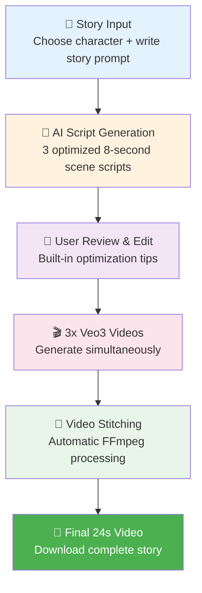

# Veo3 Story Generator - Simple Workflow

## How It Works

## Process Steps

1. **📝 Story Input**: Choose character + write story prompt
2. **🤖 AI Script Generation**: AI creates 3 optimized 8-second scene scripts  
3. **👀 User Review & Edit**: Edit scripts with built-in optimization tips
4. **🎬 3x Veo3 Videos**: Generate 3 videos simultaneously ($12 total)
5. **🔗 Video Stitching**: Automatic video stitching into final story
6. **📱 Final 24s Video**: Download your complete video story

## Key Features

- **Character Consistency**: Detailed character descriptions across all scenes
- **8-Second Precision**: Each scene exactly 8 seconds for optimal pacing
- **No Silent Moments**: Continuous dialogue or background comedy
- **Authentic Equipment**: Franchise-specific props (Star Wars blasters, etc.)
- **Cost Efficient**: $12 per story (3 × 8-second videos)
- **Professional Quality**: Cinematic camera movements and audio

## Tech Stack

- **Frontend**: HTML/CSS/JavaScript
- **Backend**: Node.js + Express
- **AI**: OpenAI GPT-4 for script generation
- **Video**: Google Veo3 via fal.ai
- **Processing**: FFmpeg for video concatenation 